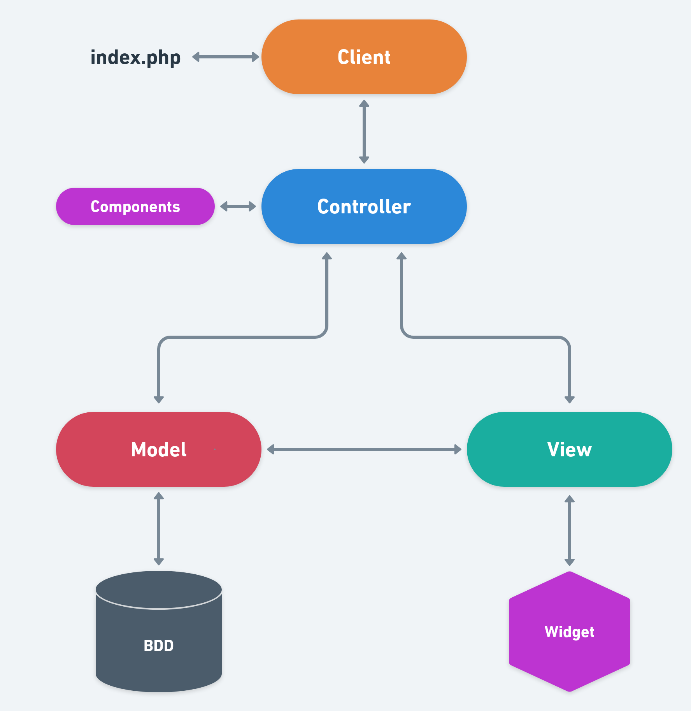

# Espoir sur pattes

## Présentation du projet 

Nous souhaitons proposer aux amoureux des animaux (associations, tout public), une plateforme facile d'accés, sur laquelle il pourront accéder rapidement si ils ont perdu ou trouvé un animal. 

Aujourd'hui il y a différentes alternatives mais qui sont payantes ce que nous trouvons regrettable.Nous ne souhaitons pas que les personnes en désarroi après la perte de leurs animaux doivent payer pour pouvoir le retrouver.
Le site sera également un espace de partage avec des articles. 
Les associations pourront ainsi communiquer sur leur événements, leurs animaux a adopter, leur actions et la recherche de bénévoles. 


## Définition des objectifs:

Entraide et conseils auprès des propriétaires d’animaux, des associations ou de toute personnes souhaitant contribuer au bien être animal.
Le site doit être simple d'accès et sécurisé
Après la création d’un compte cela doit être facile pour l’utilisateur ou les associations de publier librement des articles, des annonces ou du contenu. 

## Définition du MVP (spécifications fonctionnelles)

Fonctions minimales :
* Le visiteur arrive sur le site, il peut regarder les articles, consulter la carte pour voir les animaux perdus ou trouvés.
* Création d’un compte
* Accéder à ses propres données utilisateurs et pouvoir les modifier/améliorer.
Une fois connecté, il peut : 
* Créer des articles
* Publier une annonce d’animal perdu/trouvé.
* Entrer en contact avec le propriétaire ou la personne qui a trouvé mon animal 
* Poster un article avec du contenu ( vidéos, images )
* Réagir a des articles (Commentaires)

Nous devons :  
* Assurer la sécurité des données de l’utilisateur.
* Assurer la sécurité du site (articles avec une modération, afin d’éviter les contenus indésirables). 
Pour cela -> Création de rôles (visiteur, utilisateur, admin, superAdmin)
* Sécuriser les formulaires -> Contraintes pour mot de passe, mail etc …
* Sécuriser les routes (Page 404)


## Décrire les rôles de chacun

### Product Owner : Mounia Rizki

* Porteuse du projet, représente les intérêts des utilisateurs du site et des utilisateurs finaux 
* Tranche en cas de conflits fonctionnels ou de points de vue sur le projet.
* Gère le journal d’équipe

### Git Master, Lead Dev Front : Cédric Paje
* Effectue les choix techniques côté front, s'assure du bon fonctionnement du projet coté front
* Gère le versionning du projet
* Gère les Pull Request

### Scrum master,Lead dev Back :  Marie Charton
* Garante de l'avancement du projet
* Effectue les choix techniques côté back, s'assure du bon fonctionnement du projet coté back
* Gère l'organisation du Trello et la répartition des tâches,sa mise a jour, les tâches accomplies et leurs avancement,anime le stand-up meeting 

## Lister technos utilisées (spécifications techniques)

* HTML
* CSS
* Bootstrap
* Javascript (map carte de France) avec fichier SVG
* Composer
* Deployer
* Symfony :
    + Symfony/Profiler-Pack : Permet l'affichage d'une barre de debug.
    + Symfony/Apache-Pack : Création d'un fichier(.htaccess) de configuration utilisé par les serveurs web Apache .
    + Symfony/HTTP-Client : Fournit des utilitaires pour consommer des API et prend en charge les opérations synchrones et asynchrones .
    + Symfony/Console : Facilite la création d’interfaces de ligne de commande .
    + Symfony/Asset: Gère la génération d’URL et le versioning de ressources web .
    + Symfony/Validator: Valide les données entrées dans les formulaires .
    + Symfony/Serializer-Pack : Fournit un sérialisateur pour sérialiser/déserialiser vers et à partir d’objets et de différents formats (par ex. JSON ou XML) .
    + Symfony/Form : La création et le traitement des formulaires HTML .
    + Symfony/Mailer: Aide à envoyer des courriels.
    + Symfony/Security-Bundle : configurer le système de sécurité de votre application .
    + Symfony/ORM-Pack : Fournit tous les outils pour utiliser les bases de données dans nos applications grâce à Doctrine .
    + Symfony/Twig-Pack : Le langage de templating Twig vous permet d’écrire des modèles concis et lisibles .

## Décrire la cible :

Le site est tout public. 
Comme il sera moderé il n'y aura pas de problèmes de contenu.
L'inscription sera en revanche interdite aux mineurs 

## Décrire les potentielles évolutions :

### Possibles évolutions dans une V2 : 

* Création d'une page pour accéder a des conseils,savoir comment agir quand je trouve un animal
* Création d'un forum de conseil et d'entraide
* Création d'un page facebook ou les actualités seraient en temps réel sur le site (https://developers.facebook.com/docs/plugins/page-plugin/)
* Un utilisateur pourrait suivre l'évolution de son signalement</li>
* Un utilisateur pourrait liker un article </li>
* Un utilisateur pourrait partager un article sur ses réseaux</li>
* Créer une messagerie integrée au site ou les utilisateurs peuvent communiquer entre eux 
* Accéder a la liste de toutes les associations d'une région.Entrer en contact, faire un don etc...
* Sur la page de recherche ou d'animaux perdus , pouvoir faire une recherche avec critères ( petit/grand, poils court/long, etc...)


## Arborescence de l'appli  :

### Front


### Back 
```
App/
├── bin/
│   ├── console
│   └── ...
├── config/
│   ├── packages/
│   │   ├── dev/
│   │   │   ├── debug.yaml
│   │   │   └── ...
│   │   ├── prod/
│   │   │   ├── doctrine.yaml
│   │   │   └── ...
│   │   ├── test/
│   │   │   ├── cache.yaml
│   │   │   └── ...
│   │   ├── cache.yaml
│   │   └── ...
│   ├── routes/
│   │   ├── dev/
│   │   │   ├── framework.yaml
│   │   │   └── ...
│   │   └── annotations.yaml
│   ├── bootstrap.php
│   └── ...
├── public/   
│   ├── asset/
│   ├── index.php
│   └── ...
├── src/   
│   ├── Controller/
│   ├── Entity/
│   ├── Migrations/
│   ├── Repository/
│   └── Kernel.php
├── templates/   
│   ├── layout/
│   ├── pages/
│   └── base.html.twig
├── var/   
│   ├── cache/
│   │   └── dev/
│   └── log/
│   │   └── log/
├── vendors/   
│   ├── bin/
│   ├── composer/
│   └── .../
├── .env 
├── composer.json 
├── composer.lock 
├── deploy.php 
├── phpunit.xml.dit 
└── symfony.lock
```


## MCD 


## Charte Graphique

### Logo Rond 


### Logo Rectangle


### Les couleurs: 

La palette : https://www.color-hex.com/color-palette/807 

### Les Fonts retenues :
* Digitalfont (logo)

## User Stories :

### Navigation anonyme

| En tant que | Je veux | Afin de |
|---|---|---|
| visiteur du site | pouvoir voir la carte sans me connecter | voir si mon animal a été trouvé , ou si quelqu'un cherche l'animal que j'ai trouvé  | 
| visiteur du site | pouvoir accéder aux articles | consulter les derniers articles mis en ligne | 
| visiteur du site | pouvoir accéder à un formulaire de creation de compte | creer un compte |
| visiteur du site | pouvoir accéder à un formulaire de connexion | me connecter |
| visiteur du site | pouvoir accéder à un formulaire de contact | Entrer en contact avec les adminstrateur du site |


### Navigation avec login

| En tant que | Je veux | Afin de |
|---|---|---|
| Utilisateur du site | Réagir aux articles |Commenter un article, mettre un like |
| Utilisateur du site | Poster un article |-|
| Utilisateur du site | Acceder a mon profil |Modifier mes infos personnelles , ajouter un avatar etc...|
| Utilisateur du site | Poster un signalement |Retrouver mon animal |
| Utilisateur du site | Poster un signalement |Permettre au propriétaire de retrouver son animal |
| Utilisateur du site | Suivre mes signalement |Pouvoir les supprimer ou les modifier(ex: Animal retrouvé) |

### Admin

| En tant que | Je veux | Afin de |
|---|---|---|
| Admin | pouvoir accéder à un formulaire de connexion | me connecter |
| Admin | pouvoir accéder à l'attribution de rôles | modérer/changer les rôles |
| Admin | avoir une possibilité de modération sur le contenu | modérer et administrer le site |
| Admin | recevoir les mails du formulaire de contact | répondre aux attentes des utilisateurs |

## Dictionnaires des Données et Routes

|            | Endpoint | Method HTTP | Route Name | Description | Controller | Method |
|:----------:|----------|-------------|------------|-------------|------------|--------|
| Anonymous  | / | GET | homepage | Homepage - Form to create account | MainController | homePage |
| Anonymous  | /contact_us | GET | contact | Contact - From to contact the support | MainController | contactPage |
| Anonymous  | /about_us | GET | about | About - Everything about our association | MainController | aboutPage |
| Anonymous  | /latest_alert | GET | latest_alert | Page to see the 10 latest PetAlert | MainController | latestAlert |
| Anonymous  | /lost_pet/list | GET | lost_pet_list | Page to see all the lostPets | MainController | lostPetList |
| Anonymous  | /found_pet/list | GET | found_pet_list | Page to see all the foundPets | MainController | foundPetList |
| Anonymous  | /lost_pet/{slug} | GET | lost_pet_view | Page to see one specific lostPet | MainController | lostPetBySlug |
| Anonymous  | /found_pet/{slug} | GET | found_pet_view | Page to see one specific foundPet | MainController | foundPetBySlug |
| User  | /user/login | POST | login | Page to connect a user | UserController | userCreate |
| User  | /user/lost_pet/add | POST | lost_pet_add | Page to add one specific foundPet | UserController | lostPetCreate |
| User  | /user/found_pet/add | POST | found_pet_add | Page to add one specific foundPet | UserController | foundPetCreate |
| User  | /user/article/list | GET | article_list | Page to see the aricles from blog | UserController | articleList |
| User  | /user/article/{slug} | GET | article_view | Page to see one specific article | UserController | articleBySlug |
| User  | /user/article/add | POST | article_add | Page to add an article | UserController | articleCreate |
| User  | /user/comment/list | GET | post_list | Page to see the comments from article | UserController | commentList |
| User  | /user/comment/add | POST | post_add | Page to add a comment | UserController | commentCreate |
| User  | /user/animal_adoption | GET | animal_adoption | Page to see list of 10 featured orphelans animals & adopt category | UserController | animalAdoption |
| User  | /user/dog_adoption | GET | dog_adoption | Page to see list of 10 featured orphelans aniamls | UserController | dogAdoption |
| User  | /user/cat_adoption | GET | cat_adoption | Page to see list of 10 featured orphelans aniamls | UserController | catAdoption |
| User  | /user/bird_adoption | GET | bird_adoption | Page to see list of 10 featured orphelans aniamls | UserController | birdAdoption |
| User  | /user/other_adoption | GET | other_adoption | Page to see list of 10 featured orphelans aniamls | UserController | otherAdoption |
| Admin | /admin/article/{slug}/update | POST | article_update | Page admin to update an specific article | AdminController | articleUpdate |
| Admin | /admin/article/{slug}/delete | POST | article_delete | Page admin to delete an specific article | AdminController | articleDelete |
| Admin | /admin/comment/{slug}/update | POST | post_update | Page admin to update a comment | AdminController | commentUpdate |
| Admin | /admin/comment/{slug}/delete | POST | post_delete | Page admin to delete a comment | AdminController | commentDelete |
| Admin | /admin/user/{id}/update | POST | post_update | Page super admin to update a user | AdminController | userUpdate |
| Admin | /admin/user/{id}/delete | POST | post_delete | Page super admin to delete a user | AdminController | userDelete |
| Admin | /admin/{id}/update | POST | post_update | Page admin to update a admin | AdminController | adminDelete |
| Admin | /admin/{id}/delete | POST | post_delete | Page  admin to delete a admin | AdminController | adminUpdate |
